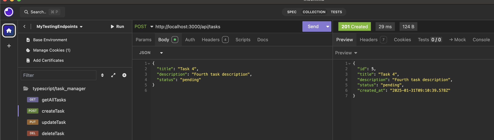

# Task Management API

**production-grade TypeScript-based REST API** built using **Node.js** and **Express**(web framework to handle HTTP requests and responses), structured for scalability, maintainability, and best practices. Here's a breakdown of what it does and how it's organized:

### **Key Features of the Application:**

1. **Task Management API**: 
   - The core of the application is a task management system where users can:
     - **Create tasks** with a title and description.
     - **Get all tasks** (list them).
     - **Update task status** (e.g., from "pending" to "completed").
   - Each task has an `id`, `title`, `description`, and `status` (which can be "pending", "in-progress", or "completed").

2. **Folder Structure**:
   - The application follows a clean architecture pattern with separate folders for:
     - **Controllers**: Handle HTTP request and response logic.
     - **Services**: Contain the core business logic (e.g., creating, updating, fetching tasks).
     - **Models**: Define TypeScript interfaces for data structures (e.g., Task).
     - **Routes**: Define the API endpoints and route handlers.
     - **Utils**: Utility functions like validation schemas.

3. **Environment Variables**:
   - The application loads sensitive configuration (like API port) from a `.env` file using the **dotenv** package.


### Steps:

1. **Set up the Project Structure**
2. **Set Up Database and Docker Compose**
3. **Install Dependencies**
4. **Create Database Models**
5. **Create Database Service**
6. **Create Controllers**
7. **Set Up Environment Variables**
8. **Write Docker Compose Init Script**
9. **Run the Application**

---

### 1. Set up the Project Structure

Here’s the basic folder structure for the TypeScript project:

```
/task-manager
├── src
│   ├── controllers
│   │   └── taskController.ts
│   ├── models
│   │   └── taskModel.ts
│   ├── services
│   │   └── taskService.ts
│   ├── routes
│   │   └── taskRoutes.ts
│   ├── utils
│   │   └── database.ts
│   ├── config
│   │   └── env.ts
│   ├── app.ts
├── .env
├── docker-compose.yml
├── init-db.sql    
├── tsconfig.json
├── package.json
└── knexfile.js
```

### 2. Set Up Database and Docker Compose

First, we’ll need to set up a PostgreSQL container with Docker Compose.

**docker-compose.yml:**

```yaml
version: '3.8'

services:
  db:
    image: postgres:13
    container_name: taskmanager-db
    environment:
      POSTGRES_USER: ${DB_USER}
      POSTGRES_PASSWORD: ${DB_PASSWORD}
      POSTGRES_DB: ${DB_NAME}
    ports:
      - "5432:5432"
    volumes:
      - ./init-db.sql:/docker-entrypoint-initdb.d/init-db.sql
    networks:
      - taskmanager-network

networks:
  taskmanager-network:
    driver: bridge
```

**init-db.sql:**

This script will run on the first initialization of the PostgreSQL container.

```sql
CREATE TABLE IF NOT EXISTS tasks (
    id SERIAL PRIMARY KEY,
    title VARCHAR(255) NOT NULL,
    description TEXT,
    status VARCHAR(50) NOT NULL,
    created_at TIMESTAMP DEFAULT CURRENT_TIMESTAMP
);

-- Add some initial data if needed
-- INSERT INTO tasks (title, description, status) VALUES ('Sample Task', 'This is a sample task description', 'pending');
```

### 3. Install Dependencies

Now, let’s install necessary dependencies for the project.

```bash
npm init -y
npm install express pg knex dotenv
npm install --save-dev typescript ts-node @types/node @types/express
npm install cors #configure CORS in  backend API server to allow requests from the frontend's origin (e.x. http://localhost:3001).
npm install @types/cors
```

### 4. Create Database Models

We’ll use Knex.js for database queries and define a Task model.

**src/models/taskModel.ts:**

```typescript
import knex from '../utils/database';

export interface Task {
    id: number;
    title: string;
    description: string;
    status: string;
    created_at: string;
}

class TaskModel {
    static async getAllTasks(): Promise<Task[]> {
        return knex('tasks').select('*');
    }

    static async getTaskById(id: number): Promise<Task | undefined> {
        return knex('tasks').where('id', id).first();
    }

    static async createTask(task: Omit<Task, 'id' | 'created_at'>): Promise<Task> {
        const [newTask] = await knex('tasks').insert(task).returning('*');
        return newTask;
    }

    static async updateTask(id: number, task: Partial<Task>): Promise<void> {
        await knex('tasks').where('id', id).update(task);
    }

    static async deleteTask(id: number): Promise<void> {
        await knex('tasks').where('id', id).del();
    }
}

export default TaskModel;
```

### 5. Create Database Service

We can create a service layer to abstract database logic from controllers.

**src/services/taskService.ts:**

```typescript
import TaskModel, { Task } from '../models/taskModel';

class TaskService {
    async getAllTasks(): Promise<Task[]> {
        return TaskModel.getAllTasks();
    }

    async getTaskById(id: number): Promise<Task | undefined> {
        return TaskModel.getTaskById(id);
    }

    async createTask(taskData: Omit<Task, 'id' | 'created_at'>): Promise<Task> {
        return TaskModel.createTask(taskData);
    }

    async updateTask(id: number, taskData: Partial<Task>): Promise<void> {
        return TaskModel.updateTask(id, taskData);
    }

    async deleteTask(id: number): Promise<void> {
        return TaskModel.deleteTask(id);
    }
}

export default new TaskService();
```

### 6. Create Controllers

Controllers will handle the requests, utilizing the service layer.

**src/controllers/taskController.ts:**

```typescript
import { Request, Response } from 'express';
import taskService from '../services/taskService';

class TaskController {
    async getAllTasks(req: Request, res: Response): Promise<void> {
        try {
            const tasks = await taskService.getAllTasks();
            res.status(200).json(tasks);
        } catch (error) {
            res.status(500).json({ error: 'Something went wrong' });
        }
    }

    async getTaskById(req: Request, res: Response): Promise<void> {
        const { id } = req.params;
        try {
            const task = await taskService.getTaskById(parseInt(id, 10));
            if (task) {
                res.status(200).json(task);
            } else {
                res.status(404).json({ message: 'Task not found' });
            }
        } catch (error) {
            res.status(500).json({ error: 'Something went wrong' });
        }
    }

    async createTask(req: Request, res: Response): Promise<void> {
        const { title, description, status } = req.body;
        try {
            const newTask = await taskService.createTask({ title, description, status });
            res.status(201).json(newTask);
        } catch (error) {
            res.status(500).json({ error: 'Could not create task' });
        }
    }

    async updateTask(req: Request, res: Response): Promise<void> {
        const { id } = req.params;
        const { title, description, status } = req.body;
        try {
            await taskService.updateTask(parseInt(id, 10), { title, description, status });
            res.status(200).json({ message: 'Task updated' });
        } catch (error) {
            res.status(500).json({ error: 'Could not update task' });
        }
    }

    async deleteTask(req: Request, res: Response): Promise<void> {
        const { id } = req.params;
        try {
            await taskService.deleteTask(parseInt(id, 10));
            res.status(200).json({ message: 'Task deleted' });
        } catch (error) {
            res.status(500).json({ error: 'Could not delete task' });
        }
    }
}

export default new TaskController();
```

### 7. Set Up Environment Variables

We’ll use a `.env` file to store database credentials.

**.env:**

```
DB_USER=your_username
DB_PASSWORD=your_password
DB_NAME=task_manager
DB_HOST=localhost
DB_PORT=5432
```

In `src/utils/database.ts`, we’ll configure Knex to connect to the database using the `.env` file.

**src/utils/database.ts:**

```typescript
import knex from 'knex';
import dotenv from 'dotenv';

dotenv.config();

const db = knex({
  client: 'pg',
  connection: {
    host: process.env.DB_HOST,
    user: process.env.DB_USER,
    password: process.env.DB_PASSWORD,
    database: process.env.DB_NAME,
    port: parseInt(process.env.DB_PORT || '5432', 10),
  },
});

export default db;
```

### 8. Write Docker Compose Init Script

As shown earlier, the Docker Compose file already includes the init script to create the `tasks` table upon the first database initialization.

### 9. Run the Application

**src/app.ts:**

```typescript
import express from 'express';
import taskRoutes from './routes/taskRoutes';

const app = express();

app.use(express.json());
app.use('/api/tasks', taskRoutes);

const PORT = process.env.PORT || 3000;

app.listen(PORT, () => {
  console.log(`Server running on port ${PORT}`);
});
```

**src/routes/taskRoutes.ts:**

```typescript
import { Router } from 'express';
import taskController from '../controllers/taskController';

const router = Router();

router.get('/', taskController.getAllTasks);
router.get('/:id', taskController.getTaskById);
router.post('/', taskController.createTask);
router.put('/:id', taskController.updateTask);
router.delete('/:id', taskController.deleteTask);

export default router;
```

### 10. Finalize and Run

To run the application, execute the following:

1. **Start Docker Compose:**

   ```bash
   docker-compose up -d
   ```

2. **Run the Application:**

   In a separate terminal, run:

   ```bash
   npx ts-node src/app.ts
   ```

3

. **Access the API:**

   Your API should be running at `http://localhost:3000/api/tasks`.

---

### 11. Test endpoints
All endpoints listed in [insomnia endpoints](insomnia-endpoints.yaml) can be imported to insomnia.

#### Get All Tasks `GET http://localhost:3000/api/tasks`


#### Create a  Task `POST http://localhost:3000/api/tasks`




#### Update a Task `PUT http://localhost:3000/api/tasks/{id}`


#### Delete a Task `DELETE http://localhost:3000/api/tasks/{id}`

